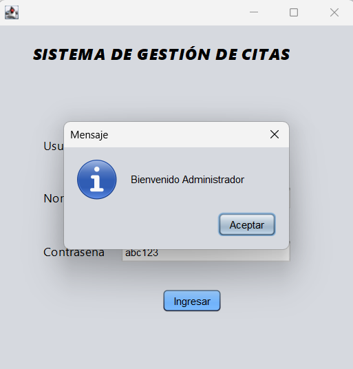
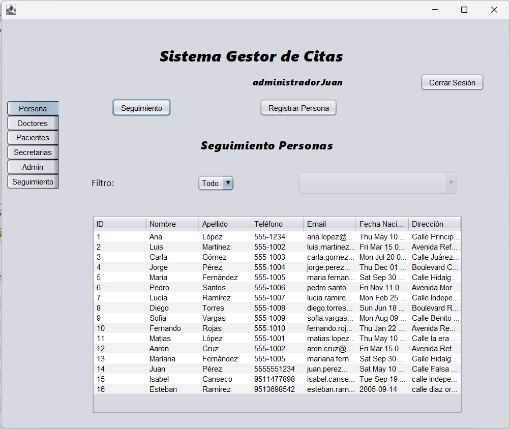
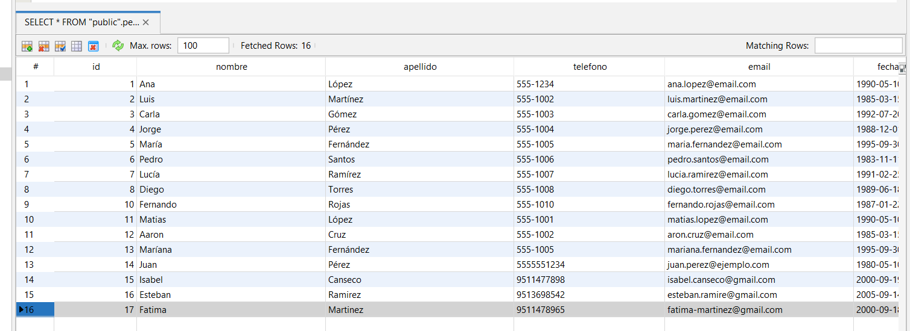
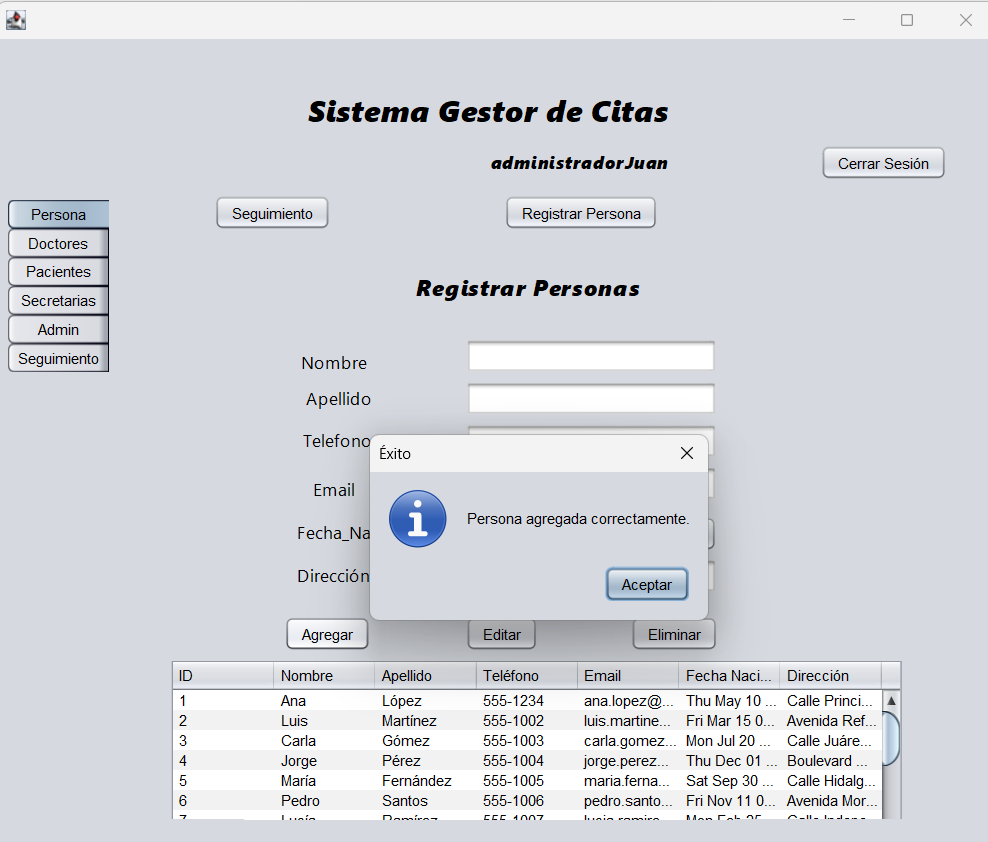
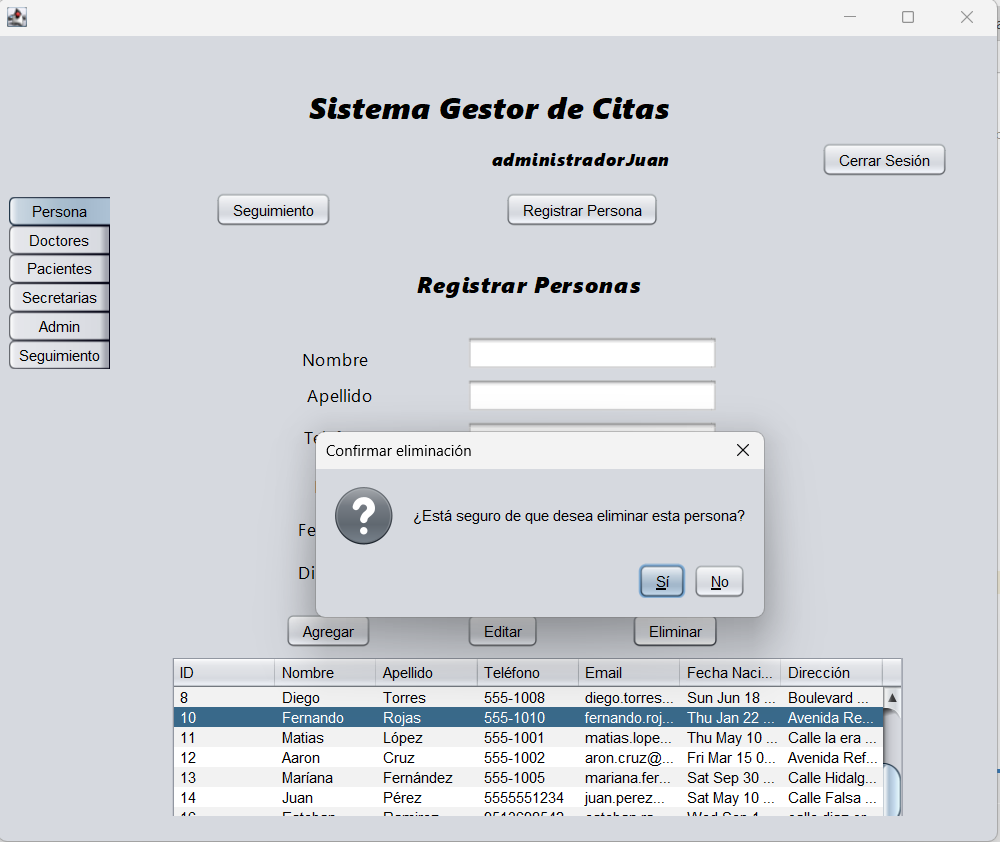
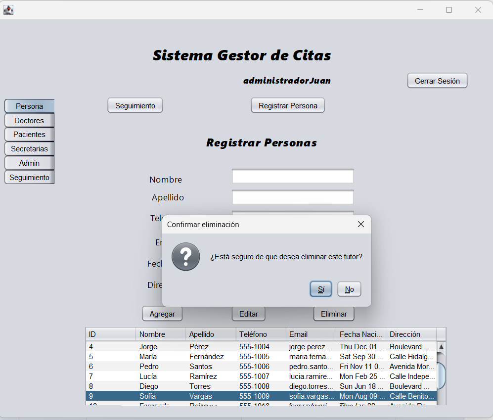
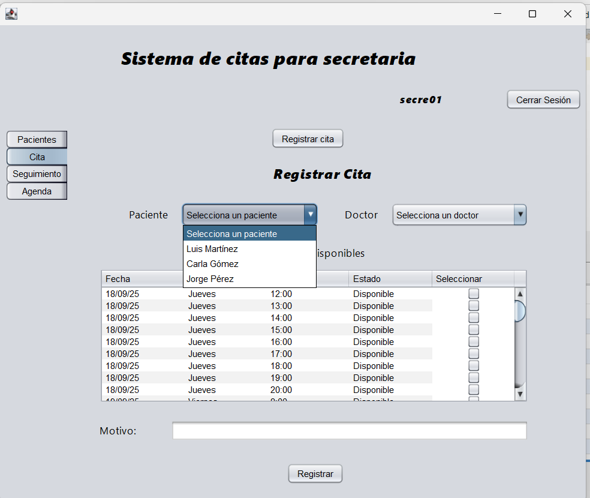
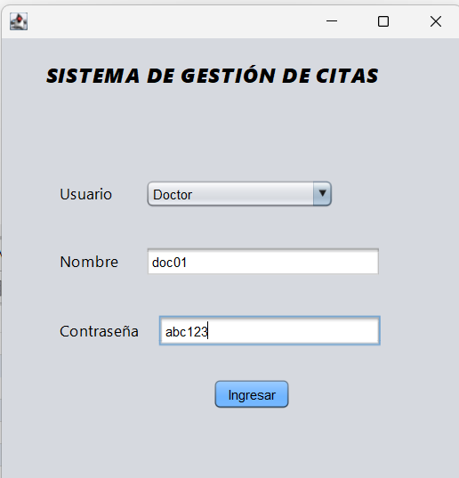

## GESTION MEDICA

proyecto generado utilizando Netbens, java como lenguaje de programacion y Postgres para base de datos

## Integrantes del equipo

Cano Cortes Abigail

Martínez López Fátima

## Planteamiento del problema

En la actualidad, el hospital gestiona las citas de los pacientes mediante listas físicas en distintas áreas, lo que incrementa la posibilidad de errores y la duplicación de datos. La carencia de herramientas tecnológicas adecuadas provoca largas filas de espera para registrar las consultas, así como la asignación de citas en horarios en los que los médicos no están disponibles.
De igual manera, el personal administrativo debe registrar manualmente tanto los horarios de los médicos como las citas de los pacientes, lo que genera procesos poco eficientes y afecta directamente la calidad del servicio. Esta situación repercute tanto en el personal, que invierte tiempo considerable en la organización de datos, como en los pacientes, quienes experimentan demoras innecesarias en su atención.
Por lo anterior, se identifica la necesidad de implementar una solución que permita digitalizar y optimizar la gestión de citas médicas, con el propósito de reducir errores, agilizar el proceso y mejorar la experiencia de los usuarios.

---

## Diagrama Entidad - Relación

---

## Diagrama Relacional

---

## Diagrama UML

---

## Login

- **Acceso a la gestion de citas**  
  aceeso para los diferentes usuarios (administrador, doctor o secretaria)

  
---

## Funcionalidades para Administrador

- **Gestión de las personas, doctor, administrador, paciente y secretaria:**  
  Creación, edición y eliminación de las personas
  

- **Panel de inicio del administrador**  

- **Filtro con todas  las personas existentes en la base de datos** 

- **Registro de doctor por parte del administrador** 

- **Registro de pacientes por parte del administrador** 

- **Registro de secretaria por parte del administrador** 

- **Registro de administrador nuevo** 

---

## Funcionalidades para Secretaria

- **creacion de personas, creacion de citas**

  

- **ccreacion de citas**

---

## Funcionalidades para  Doctor

- **Visualizacion de citas**  

---
